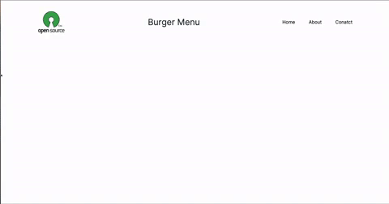

You need install tailwind and framer-motion for some animations

```bash
npm i tailwindcss framer-motion
```

also i get "useMediaQuery" from [usehooks-ts.com](usehooks-ts.com)

```ts
import { useEffect, useState } from "react";

export function useMediaQuery(query: string): boolean {
  const getMatches = (query: string): boolean => {
    // Prevents SSR issues
    if (typeof window !== "undefined") {
      return window.matchMedia(query).matches;
    }
    return false;
  };

  const [matches, setMatches] = useState<boolean>(getMatches(query));

  function handleChange() {
    setMatches(getMatches(query));
  }

  useEffect(() => {
    const matchMedia = window.matchMedia(query);

    // Triggered at the first client-side load and if query changes
    handleChange();

    // Listen matchMedia
    if (matchMedia.addListener) {
      matchMedia.addListener(handleChange);
    } else {
      matchMedia.addEventListener("change", handleChange);
    }

    return () => {
      if (matchMedia.removeListener) {
        matchMedia.removeListener(handleChange);
      } else {
        matchMedia.removeEventListener("change", handleChange);
      }
    };
    // eslint-disable-next-line react-hooks/exhaustive-deps
  }, [query]);

  return matches;
}
```

Menu component:

```ts
import { motion } from "framer-motion";
import { useState } from "react";
import { useMediaQuery } from "../util/useMediaQuery";
import logo from "/os.png";

const navMotion = {
  visible: {
    opacity: 1,
    transition: {
      when: "beforeChildren",
      staggerChildren: 0.15,
    },
  },
  hidden: {
    opacity: 0,
  },
};

const itemMotion = {
  visible: { opacity: 1, x: 0 },
  hidden: { opacity: 0, x: -100 },
};

export default function Nav() {
  const [toggle, setToggle] = useState(false);
  const matches = useMediaQuery("(min-width: 1280px)");

  return (
    <nav className="relative mx-8 mb-24 flex justify-between items-center pt-8 pb-6font-medium md:mx-16 lg:mx-32">
      <svg
        className="absolute bottom-0 left-1/2 -translate-x-1/2"
        width="250"
        height={4}
        viewBox="0 0 250 4"
        fill="none"
        xmlns="https://www.w3.org/svg"
      ></svg>

      <a href="/">
        
      </a>

      <h1 className="lg:text-3xl text-2xl text-gray-800">Burger Menu</h1>

      {/* Check if we are on mobile or not */}
      {matches && (
        <div className="flex gap-12">
          <a href="/">Home</a>
          <a href="/">About</a>
          <a
            className="flex justify-center items-center"
            href="/"
            target="_blank"
          >
            Conatct
          </a>
        </div>
      )}
      {!matches && (
        <div
          onClick={() => setToggle((prevToggle) => !toggle)}
          className="space-y-1.5 cursor-pointer z-50"
        >
          <motion.span
            animate={{ rotateZ: toggle ? 45 : 0, y: toggle ? 8 : 0 }}
            className="block h-0.5 w-8 bg-black"
          />
          <motion.span
            animate={{ width: toggle ? 0 : 24 }}
            className="block h-0.5 w-6 bg-black"
          />
          <motion.span
            animate={{
              rotateZ: toggle ? -45 : 0,
              y: toggle ? -8 : 0,
              width: toggle ? 32 : 16,
            }}
            className="block h-0.5 w-4 bg-black"
          />
        </div>
      )}
      {toggle && !matches && (
        <div className="fixed flex bg-white bottom-0 left-0 w-full h-screen items-center justify-center">
          <motion.div
            variants={navMotion}
            animate="visible"
            initial="hidden"
            className="flex flex-col gap-16 text-lg"
          >
            <motion.a variants={itemMotion} href="/">
              Home
            </motion.a>
            <motion.a variants={itemMotion} href="/">
              About
            </motion.a>
            <motion.a
              className="flex justify-center items-center"
              variants={itemMotion}
              href="/"
              target="_blank"
            >
              Contact
            </motion.a>
          </motion.div>
        </div>
      )}
    </nav>
  );
}
```
